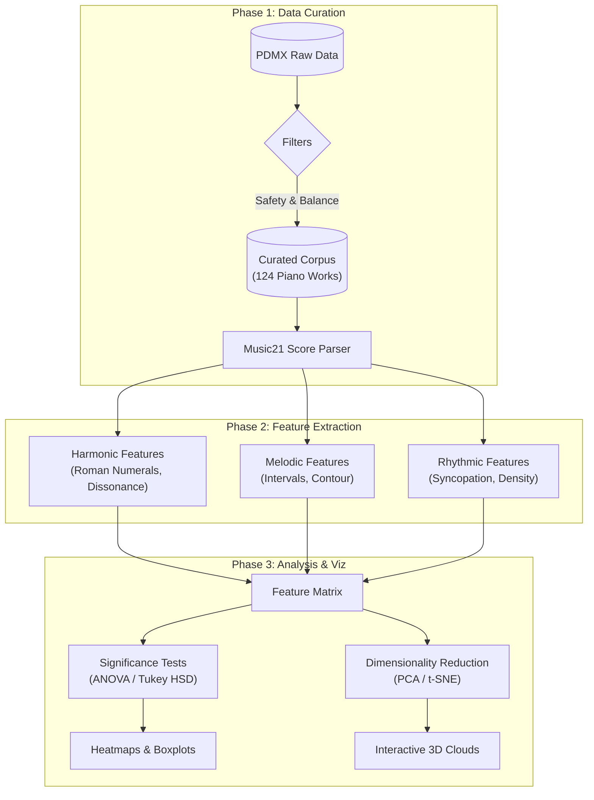

# JuFo 2026: Computational Musicology & Stylistic Embeddings


> **Jugend Forscht 2026 Entry** | *Mathematics & Computer Science*
>
> A computational analysis pipeline that quantifies musical style across the Baroque, Classical, and Romantic eras (Bach to Debussy). By processing 36 hand-crafted harmonic, melodic, and rhythmic features from symbolic scores, this project creates a high-dimensional "stylistic space" where compositions can be mathematically compared and interactively explored in 3D.

---

## Interactive Results (GitHub Pages)

Browse the interactive visualizations hosted online:

| **3D Stylistic Cloud** | **Significance Matrix** | **Annotated Scores** |
|:---:|:---:|:---:|
| [**Explore 3D PCA**](https://victor-gurbani.github.io/JuFo2026/figures/embeddings/composer_clouds_3d.html) | [**View Heatmaps**](https://victor-gurbani.github.io/JuFo2026/figures/significance/) | [**See Annotations**](https://victor-gurbani.github.io/JuFo2026/figures/annotated/) |
| *Embeds every piece in feature space* | *Pairwise composer differences* | *MusicXML analyzed with Roman numerals* |

### Highlights
- **Direct Highlights:**
    - [One Summer’s Day (Hisaishi) projection](https://victor-gurbani.github.io/JuFo2026/figures/highlights/one_summers_day_pca_cloud.html) – See how anime music blends Romantic and Impressionist traits.
    - [Ravel String Quartet projection](https://victor-gurbani.github.io/JuFo2026/figures/highlights/ravel_string_quartet_pca_cloud.html)
- **Feature Boxplots:** [Harmonic](https://victor-gurbani.github.io/JuFo2026/figures/harmonic/) | [Melodic](https://victor-gurbani.github.io/JuFo2026/figures/melodic/) | [Rhythmic](https://victor-gurbani.github.io/JuFo2026/figures/rhythmic/)

---

## Project Scale & Metrics

*   **Filtered Corpus:** Narrowed a raw archive of **254,077** PDMX entries down to a safety-screened solo piano cohort.
*   **Balanced Data:** **124** curated works (31 per composer) spanning **18,925** measures and ~11.8 hours of audio.
*   **Feature Engineering:** **36** algorithms across three pillars:
    *   **Harmonic:** 16 features (Chord quality, Roman numerals, Dissonance).
    *   **Melodic:** 11 features (Contour, Interval size, Pitch entropy).
    *   **Rhythmic:** 9 features (Syncopation, Density, Polyrhythms).
*   **Statistical Validation:** **36** omnibus ANOVA tests (27 significant @ p<0.05) and **162** post-hoc Tukey contrasts revealing 56 clear composer-to-composer separations.

---

## System Architecture

The pipeline transforms raw MusicXML data into statistical insights through a multi-stage process.



---

## Tech Stack

*   **Core Logic:** `Python 3.10+`
*   **Symbolic Music Processing:** `music21` (Parsing, Chordification, Roman Numeral Analysis)
*   **Data Manipulation:** `pandas`, `numpy`
*   **Statistics:** `scipy.stats` (F_oneway), `statsmodels` (Tukey HSD)
*   **Machine Learning:** `scikit-learn` (StandardScaler, PCA, t-SNE)
*   **Visualization:** `plotly` (Interactive 3D/2D), `seaborn` (Static statistical plots), `matplotlib`

---

## Quickstart

This project includes a fully automated script to set up the environment and run the pipeline from scratch.

### 1. Requirements
*   Python 3.8 or higher
*   Git

### 2. Auto-Run
Execute the quickstart script from the project root. It will create a `venv`, install dependencies, and generate all figures.

```bash
./quickstart.sh
```

To use your system python instead of a virtual environment:
```bash
./quickstart.sh --no-venv
```

---

## Local Web Interface (Next.js)

The interactive web UI lives in `web-interface/` and includes a **Subset Clouds** UI at `/clouds` (runs `src/clouds_from_feature_cache.py` locally and serves generated plots from `web-interface/public/generated/...`).

### Start (recommended)

From the repository root:

```bash
npm run web:install
npm run web:dev
```

Then open:

- `http://localhost:3000/` (main UI)
- `http://localhost:3000/clouds` (subset clouds generator)

### Start (manual)

```bash
cd web-interface
npm install
npm run dev
```

If you see an error like `Can't resolve 'tailwindcss' in .../JuFo2026`, it usually means the dev server was started from the wrong folder. Use the repo-root scripts above to force the correct working directory.

## Detailed Pipeline Steps

<details>
<summary><strong>1. Corpus Curation (Phase 1 Step 1)</strong></summary>

Follow these steps to regenerate the curated CSV and path list used in this project:

1. Ensure the PDMX dataset is extracted under `15571083/` at the project root and that `src/corpus_curation.py` is present.
2. From the repository root, run:
	```bash
	python3 src/corpus_curation.py --min-rating 0
	```
	This writes the balanced, safety-filtered corpus to `data/curated/solo_piano_corpus.csv` and the corresponding MusicXML paths to `data/curated/solo_piano_mxl_paths.txt`.
3. To explore alternative variants (e.g., relaxed filters or unbalanced counts), append the appropriate flags, for example:
	```bash
	python3 src/corpus_curation.py --min-rating 0 --skip-license-filter
	python3 src/corpus_curation.py --min-rating 0 --skip-license-filter --skip-deduplicated-filter --skip-unique-filter --max-per-composer 999
	```
	Each run accepts `--output-csv` and `--output-paths` if you want to save results under different filenames.

</details>

<details>
<summary><strong>2. Score Parsing (Phase 1 Step 2)</strong></summary>

Follow these steps to generate or inspect parsed summaries:

1. Ensure `music21` is installed and the curated corpus exists (defaults under `data/curated/`).
2. Parse the full corpus:
	```bash
	python3 src/score_parser.py --output data/parsed/summaries.json
	```
3. Useful flags:
	- `--limit N`: parse only the first `N` scores (smoke tests).
	- `--no-skip-errors`: abort on the first parsing failure instead of skipping.
	- `--csv PATH` / `--paths PATH`: override the curated CSV or the MusicXML path list.
4. Recompute statistics without re-parsing:
	```bash
	python3 src/score_parser.py --stats-from data/parsed/summaries.json
	```

</details>

<details>
<summary><strong>3. Harmonic Features (Phase 2 Step 1)</strong></summary>

Generate harmonic descriptors, dissonance profiles, and Roman numeral trends:

1. Ensure the curated CSV exists under `data/curated/` (use the commands above if needed).
2. Extract harmonic features and plots in one pass:
	```bash
	python3 src/harmonic_features.py --output-csv data/features/harmonic_features.csv
	```
3. Helpful flags:
	- `--limit N`: process only the first `N` scores (smoke tests).
	- `--no-skip-errors`: stop on the first extraction failure.
	- `--skip-plots`: omit boxplot generation when running headless pipelines.
	- `--features-from PATH`: load an existing CSV instead of recomputing, still enabling plots/statistics.
	- `--figure-dir DIR`: override the output directory for boxplots (default `figures/harmonic`).
	- `--csv PATH` / `--paths PATH`: point at alternate curated corpora or MusicXML path lists.
4. Example cached run that reuses the last export for quick statistics:
	```bash
	python3 src/harmonic_features.py --features-from data/features/harmonic_features.csv --skip-plots
	```

</details>

<details>
<summary><strong>4. Melodic Features (Phase 2 Step 2)</strong></summary>

Extract melodic contour and independence metrics:

1. Ensure the curated corpus is available as described above.
2. Run the melodic extractor:
	```bash
	python3 src/melodic_features.py --output-csv data/features/melodic_features.csv
	```
3. Useful flags mirror the harmonic script:
	- `--limit N`: process the first `N` scores for smoke tests.
	- `--no-skip-errors`: halt on the first parsing/extraction error.
	- `--skip-plots`: suppress boxplot generation.
	- `--features-from PATH`: reuse a previously generated CSV while still emitting stats/plots.
	- `--figure-dir DIR`: change the destination for melodic feature boxplots (default `figures/melodic`).
	- `--csv PATH` / `--paths PATH`: override the curated corpus inputs.
4. Example reuse of cached results:
	```bash
	python3 src/melodic_features.py --features-from data/features/melodic_features.csv --skip-plots
	```

</details>

<details>
<summary><strong>5. Rhythmic Features (Phase 2 Step 3)</strong></summary>

Extract rhythmic density, syncopation, and cross-hand subdivision metrics:

1. Ensure the curated corpus is available.
2. Run the rhythmic extractor:
	```bash
	python3 src/rhythmic_features.py --output-csv data/features/rhythmic_features.csv
	```
3. Useful flags (mirroring other scripts):
	- `--limit N`: process the first `N` scores for smoke tests.
	- `--no-skip-errors`: stop on the first extraction failure instead of skipping.
	- `--skip-plots`: suppress boxplot generation.
	- `--features-from PATH`: reuse a previously generated CSV for stats/plots without recomputation.
	- `--figure-dir DIR`: direct rhythmic feature plots to a custom directory (default `figures/rhythmic`).
	- `--csv PATH` / `--paths PATH`: override the curated inputs.
4. Example cached run:
	```bash
	python3 src/rhythmic_features.py --features-from data/features/rhythmic_features.csv --skip-plots
	```

</details>

<details>
<summary><strong>6. Significance Testing (Phase 2 Step 4)</strong></summary>

Run omnibus ANOVA and Tukey HSD post-hoc comparisons across every exported feature:

1. Confirm harmonic, melodic, and rhythmic CSVs exist under `data/features/`.
2. Execute the significance pipeline:
	```bash
	python3 src/significance_tests.py \
	  --anova-output data/stats/anova_summary.csv \
	  --tukey-output data/stats/tukey_hsd.csv
	```
3. Flags mirror earlier scripts:
	- `--alpha VALUE`: change the significance threshold (default `0.05`).
	- `--min-group-size N`: require at least `N` pieces per composer (default `3`).
	- `--no-tukey`: skip Tukey HSD generation (useful if only SciPy is available).
	- Alternate feature tables can be supplied with `--harmonic-csv`, `--melodic-csv`, or `--rhythmic-csv`.
4. Results:
	- `data/stats/anova_summary.csv` lists F-statistics, p-values, and sample sizes for each feature.
	- `data/stats/tukey_hsd.csv` records composer-to-composer comparisons (using `statsmodels` when available, else SciPy's implementation).
	- Optional: produce bar charts and heatmaps with
		```bash
		python3 src/significance_visualizations.py --top-n 15
		```
		This writes figures to `figures/significance/`: a top ANOVA bar chart, three pairwise heatmaps (significant-feature counts, signed mean difference, absolute mean difference), plus two feature-level heatmaps (sym-log and normalized). Count-heavy metrics (e.g., `note_event_count`, `roman_chord_count`, `dissonant_note_count`) are filtered automatically; supply additional `--exclude-pattern` flags to customise. Use `--no-symlog`, `--skip-normalized`, or adjusted `--top-n` values to tailor the views.

</details>

<details>
<summary><strong>7. Feature Embedding Explorer</strong></summary>

Create an interactive 3D scatter of every piece embedded in feature space:

```bash
python3 src/feature_embedding.py \
	--output figures/embeddings/pca_3d.html \
	--output-2d figures/embeddings/pca_2d.html \
	--loadings-csv data/stats/pca_loadings.csv \
	--clouds-output figures/embeddings/composer_clouds_3d.html \
	--clouds-output-2d figures/embeddings/composer_clouds_2d.html
```

- Default method is PCA; pass `--method tsne` (optionally `--perplexity 25`) for a non-linear view.
- Points are colour-coded by composer and expose the title and MusicXML path on hover. The HTML output can be opened in any browser.
- When using PCA the script prints variance explained per axis and writes the feature loadings to the CSV above, clarifying which metrics pull the cloud toward each direction.
- Raw count-style features (`note_count`, `note_event_count`, `chord_event_count`, `chord_quality_total`, `roman_chord_count`, `dissonant_note_count`) are excluded by default so dense chorales no longer dominate the axes; density-style metrics (e.g., `harmonic_density_mean`) still participate after standardisation.
- Supply `--clouds-output` to render a 3D Gaussian iso-surface view, and `--clouds-output-2d` for a companion filled-contour map that mirrors the scatter but suppresses individual points.
- Add `--output-2d` when you want a browser-ready 2D scatter (first two axes) alongside the 3D view—handy for presentations that prefer flat plots.
- The companion highlighter (`src/highlight_pca_piece.py`) can project external scores into the PCA space; for example, analysing Joe Hisaishi's "One Summer's Day (Spirited Away)" showed the piece landing between Chopin and Debussy in the clouds—slightly nearer to Chopin—mirroring its blend of Romantic and Impressionist traits (see `summerdayhighlight.png`).

### Embedding Cache (Fast Reuse + Long-Running Full-Corpus Caching)

For interactive workflows (highlighting pieces, web UI projections, repeated analysis runs), it is wasteful to refit PCA each time. This project includes a persistent cache that stores the 3D coordinates for every piece **plus** the PCA artifacts needed to project *new* pieces into the same PCA space.

#### 1) Build / refresh the canonical cache (curated feature tables)

This computes PCA once from the existing feature CSVs and writes an atomic cache CSV + metadata:

```bash
python3 src/embedding_cache.py --method pca
```

Outputs:
- `data/embeddings/pca_embedding_cache.csv` (one row per piece, includes `mxl_abs_path`, `dim1..dim3`)
- `data/embeddings/pca_embedding_cache.csv.meta.json` (hashes + PCA artifacts: imputation means, scaler params, PCA components)

The script is idempotent: if the cache exists and the input feature CSVs are unchanged, it prints that the cache is already up-to-date.

Compatibility is validated via the sidecar meta JSON (including SHA256 hashes of the harmonic/melodic/rhythmic feature CSVs, PCA method/seed, and the excluded-feature list). If any of these change, consumers refit PCA unless you explicitly point them at a different cache.

#### 2) Project and cache a *different* corpus (full PDMX or custom lists) for days, resumable

Once you have a PCA space (from the canonical cache above), you can project additional pieces into that PCA space and append them to a separate output cache.

This mode is designed for long-running runs that can be stopped/restarted without losing progress:

```bash
python3 src/embedding_cache.py \
	--project-only \
	--model-cache data/embeddings/pca_embedding_cache.csv \
	--corpus-csv 15571083/PDMX.csv \
	--dataset-root 15571083 \
	--output-csv data/embeddings/pdmx_projected_cache.csv \
	--resume
```

<details>
<summary>Copy/paste: full PDMX projection + full-feature cache (multi-core, resumable)</summary>

```bash
python3 -u src/embedding_cache.py --project-only --model-cache data/embeddings/pca_embedding_cache.csv --corpus-csv 15571083/PDMX.csv --dataset-root /Users/victor/JuFo2026/15571083 --output-csv data/embeddings/pdmx_projected_cache.csv --output-features-csv data/embeddings/full_pdmx_feature_cache.csv --resume --checkpoint-every 200 --progress-every 200 --workers 8 --chunksize 8
```

</details>

#### 2b) Cache the full 36-feature vectors for a large corpus (enables instant subset-specific PCA)

If you want to recompute PCA with *correct axes for any custom subset* (e.g., add jazz composers, switch eras, or compare arbitrary composer sets), cache the full feature vectors instead of only `dim1..dim3`.

This writes a large CSV where each row contains identifiers plus all feature columns (schema derived from the curated feature CSV headers):

```bash
python3 src/embedding_cache.py \
	--project-only \
	--no-embedding-cache \
	--corpus-csv 15571083/PDMX.csv \
	--dataset-root 15571083 \
	--output-features-csv data/features/full_pdmx_feature_cache.csv \
	--resume
```

You can also write both caches in one run (full features + projected PCA dims) by omitting `--no-embedding-cache` and supplying both `--output-csv` and `--output-features-csv`.

Notes:
- Use `--paths some_list.txt` instead of `--corpus-csv` if you already have a newline-delimited list of MusicXML paths.
- Progress is tracked via a sidecar `*.done.txt` file next to the output CSV, so reruns skip already-cached items.
- `--checkpoint-every N` updates metadata periodically; the output CSV is appended row-by-row so crashes/interruption keep completed work.
- For speed on large corpora, add `--workers N` (and optionally `--chunksize K`) to parallelize feature extraction in `--project-only` mode.

#### 3) Cache usage by other scripts / UI

- `src/highlight_pca_piece.py` now reuses `data/embeddings/pca_embedding_cache.csv` when it exists and is compatible; if the requested piece is missing, it projects it into the cached PCA space instead of refitting PCA.
- `src/feature_embedding.py` (the standard embedding/cloud generator) will reuse the PCA cache automatically when `--method pca` and the cache is compatible with the current feature CSVs; use `--no-cache` to force refitting, or `--embedding-cache PATH` to point at a different cache.
- The Next.js API route `web-interface/app/api/pca/route.ts` prefers the cache CSV when present.

#### 4) Instant subset clouds from the full-feature cache (canonical axes vs refit axes)

Once you have cached full feature vectors for a large corpus (e.g. the full PDMX), you can generate composer clouds *instantly* for arbitrary composer sets without re-parsing MusicXML.

Use `src/clouds_from_feature_cache.py`:

- **Canonical axes**: project your subset into the fixed PCA space fit on the canonical dataset (Bach/Mozart/Chopin/Debussy). This is the best view for cross-subset comparability.
- **Refit axes**: refit PCA on the subset itself. This emphasizes local structure but changes axes.

Example using the provided config groups in `configs/composer_sets.example.json`:

```bash
python3 src/clouds_from_feature_cache.py \
	--feature-cache data/embeddings/full_pdmx_feature_cache.csv \
	--config configs/composer_sets.example.json \
	--group jazz_classic \
	--axes both \
	--max-per-composer 60 \
	--write-subset-csv
```

See `COMPOSER_SETS.md` for more curated example groups (jazz, Spanish nationalist, pop/modern, anime/film, video-game, etc.).

Quick start (cloud comparisons):

```bash
# Canonical axes (comparable across groups):
python3 src/clouds_from_feature_cache.py --feature-cache data/embeddings/full_pdmx_feature_cache.csv --config configs/composer_sets.example.json --group spanish_nationalist --axes canonical --outdir figures/embeddings

# Refit axes (best within-group structure, but axes change per group):
python3 src/clouds_from_feature_cache.py --feature-cache data/embeddings/full_pdmx_feature_cache.csv --config configs/composer_sets.example.json --group spanish_nationalist --axes refit --outdir figures/embeddings

# Both (writes canonical + refit outputs for easy A/B comparison):
python3 src/clouds_from_feature_cache.py --feature-cache data/embeddings/full_pdmx_feature_cache.csv --config configs/composer_sets.example.json --group spanish_nationalist --axes both --outdir figures/embeddings --write-subset-csv
```

</details>

<details>
<summary><strong>8. MusicXML Harmonic Annotation</strong></summary>

Generate colour-coded MusicXML files that highlight dissonant material and the harmonic backdrop for inspection in MuseScore or other editors:

```bash
python3 src/annotate_musicxml.py \
	--mxl 15571083/mxl/0/46/Qmaug5pXs59BJq1VTdXhrKAU3DHxRqusrDgXraMS6xDtYk.mxl \
	--output figures/annotated/La_cathedrale_annotated.mxl \
	--renderer-template "mscore -o {output} {input}" --render-format pdf
```

- Notes classified as passing tones, appoggiaturas, or other dissonances reuse the feature-extraction heuristics, receive distinct colours, and gain lyric labels for quick inspection. Remaining notes in dissonant chords are tinted red and marked `dissonant-chord`.
- Every harmonic slice now carries a chord label (Roman numeral when the global key is recognised, otherwise a plain-text name) injected both as a text direction and as a chord symbol above the staff. The rendered chord symbol now displays the analysis text directly (falling back to a descriptive label), and the same string is duplicated as a text expression so MuseScore visibly shows the chord even if the symbol fallback fires. Chords containing chromatic notes outside the detected scale—or chords the analyser cannot explain—receive a turquoise tint and the lyric `chromatic-chord` so they stand out in the rendered score.
- Supply a renderer template (shown above for the MuseScore CLI) to emit a PDF or PNG alongside the annotated MusicXML for collaborators without engraving software.
- Open the exported MusicXML or rendered file to review how the analysis aligns with the original notation and to spot-check the automated classifications.

### Curated Score Exports

Regenerate the eight canonical annotated scores (two per composer) in one shot:

```bash
python3 src/generate_selected_annotations.py
```

- The script resolves absolute MusicXML paths from `data/curated/solo_piano_corpus.csv` and writes annotated outputs to `figures/annotated/` using the same naming conventions documented above.
- Optional `--renderer-template` and `--render-format` flags mirror the one-off annotator so PDFs/PNGs can be produced alongside the MusicXML payloads.

</details>

---

## Code Highlights

### Intelligent Feature Pre-processing
To prevent dense pieces (like Chorales) from artificially dominating the stylistic space simply due to having "more notes", pure count-based features are excluded from the PCA matrix, prioritizing *density* and *ratios* instead.

```python
# src/feature_embedding.py

EXCLUDED_FEATURES = {
    "note_count",          # Absolute counts bias towards long pieces
    "note_event_count",
    "chord_event_count",
    "dissonant_note_count" 
}

def _prepare_feature_matrix(df: pd.DataFrame) -> tuple[np.ndarray, List[str], StandardScaler]:
    # Select only numeric columns and filter out excluded absolute counts
    numeric_cols = [col for col in df.columns if pd.api.types.is_numeric_dtype(df[col])]
    numeric_cols = [col for col in numeric_cols if col not in EXCLUDED_FEATURES]
    
    # Fill N/A with mean to handle edge cases (e.g. pieces with no chords)
    filled = df[numeric_cols].copy().fillna(filled.mean())
    
    # Standardize to mean=0, var=1 for PCA
    scaler = StandardScaler()
    matrix = scaler.fit_transform(filled.values)
    return matrix, numeric_cols, scaler
```

---

## Data & License

- **Training Corpus:** Sourced from the [PDMX Public Domain MusicXML Dataset](https://gitlab.com/shimorina/pdmx) (Long et al., 2024). All training scores (Bach, Mozart, Chopin, Debussy) are in the public domain.
- **Case Studies:** The analysis of *One Summer's Day* (Joe Hisaishi) is a derivative visualization of a copyrighted work presented under fair use for non-commercial academic research. The original score file is not distributed with this repository.
- **Code:** Licensed under MIT.

---

*Authored by **Victor Gurbani** | 2025-2026*